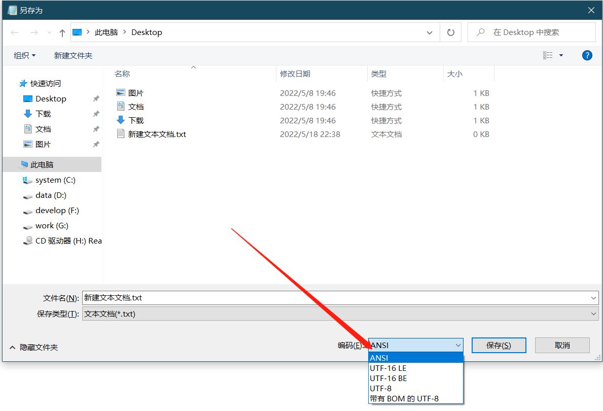

## git-pull/push脚本
### 基础指令
- pull  
```
@echo on 
git pull origin master

```
- push
```
@echo on
git add .
set record="zhangyang于%date:~0,4%-%date:~5,2%-%date:~8,2% %time:~0,8%一键提交"
git commit -m %record%
git push origin "master"
``` 

### 多目录指令
- pull
    ```
    @echo on
    G:
    cd \Documents\gitee\chinaway
    git pull origin master

    cd \Documents\github\simple_note
    git pull origin main
    ```
- push
    ```
    @echo on
    set record="zhangyang于%date:~0,4%-%date:~5,2%-%date:~8,2% %time:~0,8%一键提交"

    G:
    cd \Documents\gitee\chinaway
    git add .
    git commit -m %record%
    git push origin "master"

    cd \Documents\github\simple_note
    git add .
    git commit -m %record%
    git push origin "main"
    ```

***注意!!!***  
- *目录与分支需要自定义*  
- *注意bat文件需要ansi编码(新建空白txt打开后另存为,此时可更改编码,参考下图)*
    
      

- *基础指令需放在同步目录下,实现一键pull或push;也可添加路径,放在任意位置使用*
- *进阶指令可放在任意位置使用,可参照下列的全自动方案实现开机自动pull以及关机自动push*

### 全自动化方案
win10系统下,计算机管理->系统工具->任务计划程序->创建基本任务